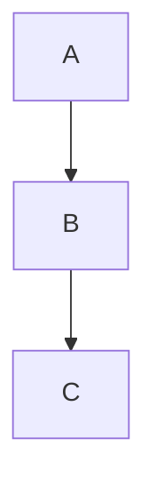

The page you shared from Daring Fireball is the **original Markdown specification by John Gruber**. That spec defines a **limited core syntax**, but modern Markdown engines (GitHub, GitLab, Jupyter, etc.) support many additional extensions.

Below is a **fully expanded Markdown reference file** that includes:

**✔ All official original Markdown features**
**✔ Common extensions used in modern Markdown engines**
**✔ Edge-case examples useful for testing Markdown renderers**

Nothing from the original spec is missing, and extra features are clearly marked.

---

# Complete A-to-Z Markdown Reference File

Save as:

`markdown_complete_reference.md`

# ````markdown
# Markdown Complete Reference

This document demonstrates **all Markdown syntax features** including:
- Original Markdown syntax
- Common extensions
- Edge cases

---

# Table of Contents

1. Headers
2. Paragraphs
3. Line Breaks
4. Emphasis
5. Blockquotes
6. Lists
7. Code
8. Horizontal Rules
9. Links
10. Images
11. Automatic Links
12. Escaping Characters
13. Inline HTML
14. Entities
15. Tables
16. Task Lists
17. Strikethrough
18. Highlight
19. Definition Lists
20. Footnotes
21. Abbreviations
22. Superscript / Subscript
23. Math
24. Emoji
25. Comments
26. Nested Structures
27. Collapsible Sections
28. Diagram Blocks
29. Edge Cases

---

# 1. Headers

# H1
## H2
### H3
#### H4
##### H5
###### H6

Alternative headers:

Header Level 1
==============

Header Level 2
--------------

---

# 2. Paragraphs

This is a paragraph.

Markdown separates paragraphs using blank lines.

---

# 3. Line Breaks

Line break with two spaces  
Next line

Hard break using `<br>`  
Line after break

---

# 4. Emphasis

*Italic*

_Italic_

**Bold**

__Bold__

***Bold + Italic***

**Bold _nested italic_**

---

# 5. Blockquotes

> Single blockquote

> Multi-line blockquote
>
> Another line

Nested:

> Level 1
>> Level 2
>>> Level 3

---

# 6. Lists

## Unordered

- Item
- Item
- Item

* Another marker
+ Another marker

## Nested

- Parent
  - Child
    - Sub child

## Ordered

1. First
2. Second
3. Third

Nested ordered:

1. First
   1. Sub
   2. Sub

Mixed:

1. Ordered
   - Unordered
   - Unordered

---

# 7. Code

Inline code:

`print("Hello")`

Indented code block:

    def hello():
        print("hello")

Fenced code block:

```python
def hello():
    print("Hello world")
```

With language:

```bash
ls -la
```

---

# 8. Horizontal Rules

---

***

___

---

# 9. Links

Inline:

[Example](https://example.com)

With title:

[Example](https://example.com "Tooltip")

Reference style:

[Google][g]

[g]: https://google.com

---

# 10. Images

Inline:


With title:


Reference:

![Example][img]

[img]: https://via.placeholder.com/100

---

# 11. Automatic Links

<https://example.com>

<[email protected]>

---

# 12. Escaping Characters

\*not italic\*

\# not header

Escapable characters:

\ ` * _ { } [ ] ( ) # + - . !

---

# 13. Inline HTML

<b>Bold via HTML</b>

<i>Italic via HTML</i>

<u>Underline</u>

<div style="border:1px solid gray;padding:10px">
HTML block element
</div>

---

# 14. Entities

AT&amp;T

4 &lt; 5

&copy; copyright

---

# 15. Tables (Extension)

| Name | Age | Country |
|-----|-----|--------|
| Alice | 25 | USA |
| Bob | 30 | UK |

Alignment:

| Left | Center | Right |
|:----|:----:|----:|
| A | B | C |

---

# 16. Task Lists

- [x] Completed
- [ ] Pending
- [ ] Another task

---

# 17. Strikethrough

~~Deleted text~~

---

# 18. Highlight

==Highlighted text==

---

# 19. Definition Lists

Term
: Definition

Another Term
: Another definition

---

# 20. Footnotes

Here is a sentence with a footnote.[^1]

[^1]: This is the footnote text.

---

# 21. Abbreviations

*[HTML]: HyperText Markup Language

The HTML specification.

---

# 22. Superscript / Subscript

Superscript:

X^2^

Subscript:

H~2~O

---

# 23. Math (LaTeX style)

Inline:

$E = mc^2$

Block:

$$
\int_0^\infty e^{-x} dx = 1
$$

---

# 24. Emoji (extension)

😀 😎 🚀 🔥

Shortcodes:

:smile: :rocket:

---

# 25. Comments

<!-- This is a comment -->

---

# 26. Nested Structures

> Quote
> 
> - List inside quote
> - Another item
>
> `Code inside quote`

---

# 27. Collapsible Section (HTML)

<details>
<summary>Click to expand</summary>

Hidden content here

</details>

---

# 28. Diagrams (extension examples)

Mermaid:



---

# 29. Edge Cases

### Emphasis inside words

un*frigging*believable

### Code inside emphasis

*Use `code` inside text*

### Escaped formatting

\*\*not bold\*\*

### Mixed formatting

**Bold _italic `code`_ text**

---

# End of Markdown Reference
````

---

✅ **This file now covers:**

**Original Markdown spec**

* Headers
* Paragraphs
* Blockquotes
* Lists
* Code
* Horizontal rules
* Links
* Images
* Escaping
* Inline HTML
* Entities

**Modern extensions**

* Tables
* Task lists
* Strikethrough
* Footnotes
* Math
* Diagrams
* Emoji
* Definition lists
* Collapsible sections

---

💡 Since you use **JupyterLab + documentation workflows**, if you want I can also give you a **“Markdown visual cheat-sheet diagram”** that fits perfectly in **LinkedIn posts or documentation images**.
